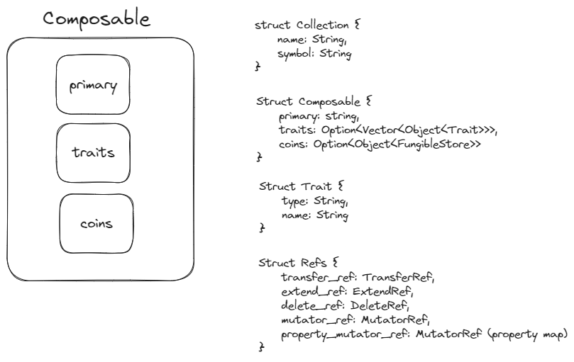

# Studio - NFT creation tool leveraging token v2
Hack Singapore 2023

## Modules structure


## How we're leveraging Aptos Labs token v2?
- We're using the `aptos_token_objects` module to create collections, mint tokens, and customize token metadata.

1. Create a collection:
    - Collections are created using the `aptos-object-token/collection.move`.
    - Name, symbol, and the supply type are stored in the `Collection` resource.
    ```rust
    #[resource_group_member(group = aptos_framework::object::ObjectGroup)]
    struct Collection has key {
        name: String,
        symbol: String,
        type: String
    }
    ```
2. Mint a token:
    - Tokens are minted using the `mint_token_internal` function, which is defined in the `core.move` module, and built on top of the `aptos-object-token/token.move`.
    - The minting function returns a `ConstructorRef` which is used later to generate references.
    ```rust
    // core.move
    public fun mint_token_internal<T>(
        creator_signer: &signer,
        collection_name: String,
        description: String,
        type: String,
        name: String,
        num_type: u64,
        uri: String,
        traits: vector<Object<Trait>>, // if compoosable being minted
        property_keys: Option<vector<String>>,
        property_types: Option<vector<String>>,
        property_values: Option<vector<vector<u8>>>
    ): ConstructorRef
    ```
    - token references are stored in a seperate resource.
    ```rust
    #[resource_group_member(group = aptos_framework::object::ObjectGroup)]
    struct References has key {
        burn_ref: token::BurnRef, 
        extend_ref: object::ExtendRef,
        mutator_ref: token::MutatorRef, 
        property_mutator_ref: property_map::MutatorRef, 
        transfer_ref: object::TransferRef
    }
    ```
3. Customize token metadata:
- Each Trait can have properties, which are also defined by the creator.
- Properties are initiated when minting the trait token.
    ```rust
    let (
        unrwaped_property_keys,
        unrwaped_property_types,
        unrwaped_property_values
        ) = (
            option::extract(&mut property_keys),
            option::extract(&mut property_types),
            option::extract(&mut property_values)
            );

        let properties = property_map::prepare_input(
            unrwaped_property_keys,
            unrwaped_property_types,
            unrwaped_property_values
            );
            
        property_map::init(&constructor_ref, properties);
    ```


## How we achieve objects being embeddable in Primary NFT?
- We categorize tokens into two types: `Composable` and `Trait`.
- `Composable` is the "atom" of the token, a storage state for the primary NFT.
- It holds the primary token, a vector traits, and a vector of fungible assets.
```rust
struct Composable has key {
    name: String,
    traits: vector<Object<Trait>>,
    coins: vector<Object<FungibleStore>>
}
```
- `Trait` represents a trait NFT that can be embedded in a Primary NFT.
- It has a `type` and a `name`.
```rust
struct Trait has key {
    type: String,
    name: String
}
```
- The following steps are taken to embed a trait in a primary NFT:
    1. transfer `trait_object` to `composable_object`.
    2. freeze transfer for the `trait_object` .
    3. insert the `object_trait` in traits vector.
```rust
// core.move
// Compose trait to a composable token
public fun equip_trait_internal(
    owner_signer: &signer,
    composable_object: Object<Composable>,
    trait_object: Object<Trait>
) acquires Composable, References {
    // Composable 
    let composable_resource = borrow_global_mut<Composable>(object::object_address(&composable_object));
    // Trait
    let trait_references = borrow_global_mut<References>(object::object_address(&trait_object));
    // index = vector length
    let traits = composable_resource.traits;
    let index = vector::length(&traits);
    // Add the object to the vector
    vector::insert<Object<Trait>>(&mut traits, index, trait_object);
    // Assert ungated transfer enabled for the object token.
    assert!(object::ungated_transfer_allowed(trait_object) == true, E_UNGATED_TRANSFER_DISABLED);
    // Transfer
    object::transfer_to_object(owner_signer, trait_object, composable_object);
    // Disable ungated transfer for trait object
    object::disable_ungated_transfer(&trait_references.transfer_ref);
}
```

## How we adapt the graphics of PFP with trait changes?
- Updating the URI is done when executing the entry function `equip_trait`.
- This involves mutating the uri of the primary token with `new_uri` using the inline function `update_uri`.
```rust
inline fun update_uri(
    composable_object_address: address,
    new_uri: String
) { core::update_uri_internal(composable_object_address, new_uri); }
```

- `new_uri` is generated by the studio and is not prompted to the user (check customize page).

```rust
// studio.move
public entry fun equip_trait(
    owner_signer: &signer,
    composable_object: Object<Composable>,
    trait_object: Object<Trait>,
    new_uri: String // User should not prompt this! It should be generated by the studio.
) {
    core::equip_trait_internal(owner_signer, composable_object, trait_object);
    // Update uri
    update_uri(
        object::object_address(&composable_object),
        new_uri
        );
    // Emit event
    events::emit_composition_event(events::composable_token_metadata(composable_token_object),events::object_token_metadata(object_token_object),new_uri);
}
