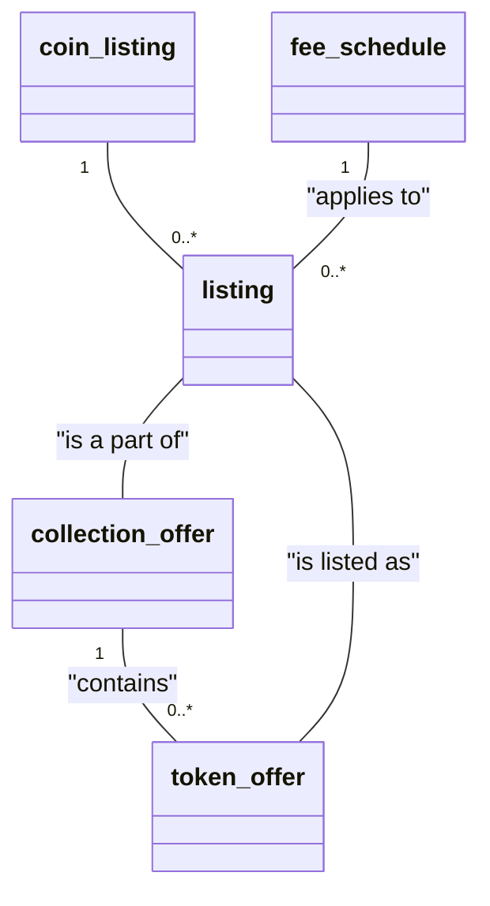
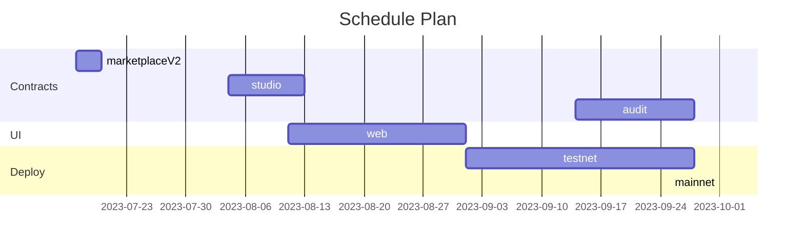

# Marketplace

A marketplace for trading NFTs leveraging Aptos and Token V2.

## Roadmap

1. [ ] Create marketplace contracts
2. [ ] Create studio contracts
3. [ ] Create a marketplace for web
4. [ ] Create a studio for web
5. [ ] Create a marketplace for mobile

--------------------

## Initial Structure

### Off-chain

These are the functionalities that will be implemented off-chain.

#### Marketplace

- Combine listed NFTs to get overview of the end product.

#### Studio

- Combine owned NFTs to get overview of the end product.

### On-chain

#### Marketplace

(forking move-examples/marketplace.move)
- Buy/Sell NFTs.
- Auction NFTs.
> Class Diagrams will be implemented upon discussing the structure explictly.

#### Studio

built on top of aptos_token.move
functionalities:
- Create tokenV2 and collections.
- Create Dynamic NFTs.
- Create Composed NFTs.
> Class Diagrams will be added soon.

## Schedule

